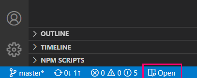
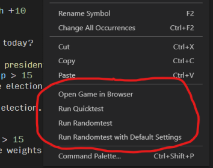

# ChoiceScript VS Code


[](https://codecov.io/gh/sgranade/choicescript_vscode)


A VS Code plugin for [ChoiceScript](https://github.com/dfabulich/choicescript/), a language for writing choose-your-own-path text games.

## Features

- Autocomplete
- Syntax highlighting
- Error highlighting
- Go to definition
- Highlight usage
- Scene outline
- Rename variables project-wide
- Run your game in the browser
- Run [Randomtest and Quicktest](https://www.choiceofgames.com/make-your-own-games/testing-choicescript-games-automatically/) automated tests
- Snippets to match Choice of Games style rules
- Italicizing and bolding text
- Word count that counts only what the player will see

## Installation

[Install from the VSCode extension marketplace](https://marketplace.visualstudio.com/items?itemName=StephenGranade.choicescript-vscode).

## Getting Started

Open your ChoiceScript folder, often named `mygame`, and the language server will index the entire project.

Note that, since ChoiceScript files are just text files, the extension treats all `.txt` files as ChoiceScript files. To avoid that, only enable the extension for workspaces that contain your ChoiceScript game.

## Running and Testing Your Game

To run the game, press the Open button on the left side of the bottom status bar.



The game will open in your default browser. To restart the game, reload the browser window. The game will update with any changes you've made to your files.

## Testing Your Game

You can test your game using ChoiceScript's [Randomtest and Quicktest](https://www.choiceofgames.com/make-your-own-games/testing-choicescript-games-automatically/) utilities. Randomtest plays your game repeatedly to find bugs, making random selections at each choice. Quicktest methodically tests each #option in every choice.

To run the tests, right-click on one of your game files and select the test you want from the context menu.



Quicktest results will appear in the Output window at the bottom of the editor. If Quicktest finds an error, the extension will add an annotation to the line with the error.


Randomtest requires more steps. When you run Randomtest, the extension will prompt you for how many times to run randomtest, whether to show the game's text, and more. To skip that step, you can set default Randomtest settings in the [extension's settings](https://code.visualstudio.com/docs/getstarted/settings).

If you run Randomtest without it printing the game's text, the results will appear in the Output window. If it prints the game's text, the results will open in a separate editor window that you can save. However, Randomtest can produce larger files than VS Code will allow the extension to open. In that case, it will save the results to a text file in your workspace. You can then open the file yourself.


## Settings

To use the style snippets that turn `...` into an ellipsis and `--` into an em-dash, [enable snippet tab completion](https://code.visualstudio.com/docs/editor/userdefinedsnippets#_creating-your-own-snippets). Then type three periods and hit tab to turn them into an ellipsis.

For writing ChoiceScript games, VS Code's auto-word suggestions can be annoying. To turn it off for ChoiceScript:

- Press `F1` to open the command palette
- Type in `Preferences: Configure Language Specific Settings...` and run that command
- Select "ChoiceScript" from the dropdown
- Add the following text to the `settings.json` file that VS Code opens
```
{
    "[choicescript]": {
        "editor.quickSuggestions": {
            "other": false,
            "comments": false,
            "strings": false
        }
    }
}
```

## Currently Unsupported Features

- [Array notation](https://forum.choiceofgames.com/t/new-choicescript-features-for-programmers/8423). Right now it ignores arrays entirely.

## Release Notes

### [1.6.0]

- Variables aren't flagged as not existing until the full project has been indexed, getting rid of the flash of errors on startup.
- choicescript_stats is now recognized as a scene, allowing autocomplete and fixing erroneous warning messages.
- Empty `*if`/`*elseif`/`*else` errors now don't put the error squigglies on the whole line.
- Functions in multireplaces, like `@{not(var) one|two}`, are now parsed correctly.
- Label indexing now properly handles labels with punctuation.

### [1.5.0]

- Warn when a `*temp` variable has the same name as an earlier-created one.
- `*create`, `*temp`, `*gosub`, and `*gosub_scene` now properly provide variable completions.

### [1.4.3]

- Variable completion now works properly in multireplaces.
- Multireplace error catching improved.
- Multireplace syntax highlighting now properly handles nested parentheses thanks to [a timely mailing list email from 2007](https://lists.macromates.com/textmate/2007-September/022055.html).
- Can you tell I focused on multireplaces this go-round?

### [1.4.2]

- Greatly sped up the extension by refactoring parsing and validation.
- Expression errors inside `*if` blocks and similar are now marked in the proper location.
- Multireplace errors inside `*if` blocks and similar are now marked in the proper location.

### [1.4.1]

- Bug fixes to symbol indexing and syntax highlighting.
- Improved error handling for `*label` and `*if` in front of an `#option`.

### [1.4.0]

- Word counter added that skips code but counts words shown to the reader.
- Improved parsing and error checking of `*choice` and `*if`/`*elseif`/`*else` blocks.

### [1.3.0]

- The document outline now lists all individual options in a choice.

### [1.2.0]

- The document outline lets you see the flow of choices, labels, and variables in your game.
- Expanded error checking in expressions to commands like `*if`.
- Expanded warnings on text that will be ignored.

### [1.1.0]

- Added ability to italicize text using `Ctrl`+`i` or `Ctrl`+`Shift`+`i` and bold text using `Ctrl`+`Shift`+`b`.
- Labels and achievements can now be found and renamed.
- Choices with more than 15 words are now flagged for review.
- Error catching greatly expanded.

### [1.0.0]

Created a language server for ChoiceScript, which provides the following features:

- IntelliSense automatic code completion for ChoiceScript commands like `*choice`
- Diagnostics to highlight errors
- Variable name changes project-wide
- Auto-indention after commands that require it, like `*choice` and `*if`
- Snippets to turn ... into an ellipsis and -- into an em-dash to match Choice of Games typography
